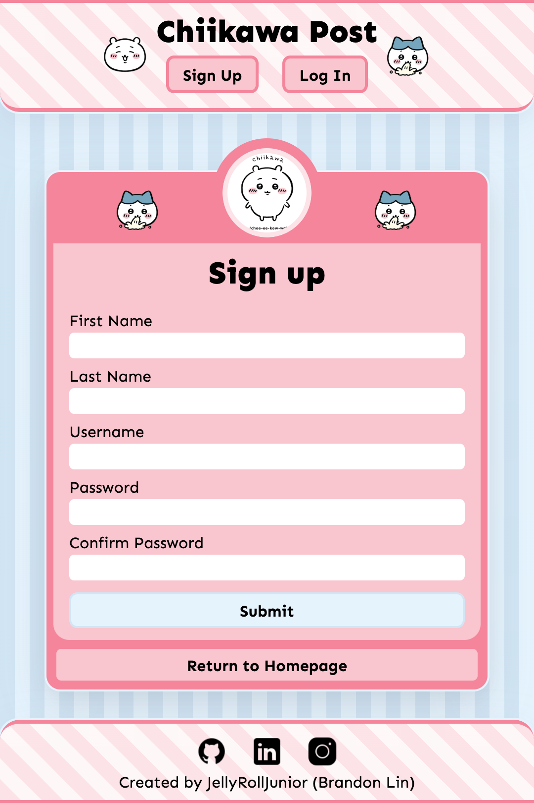
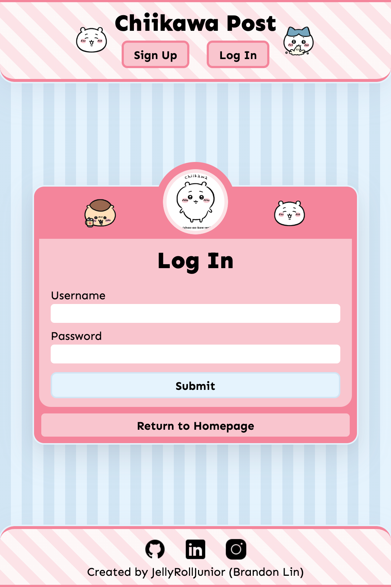
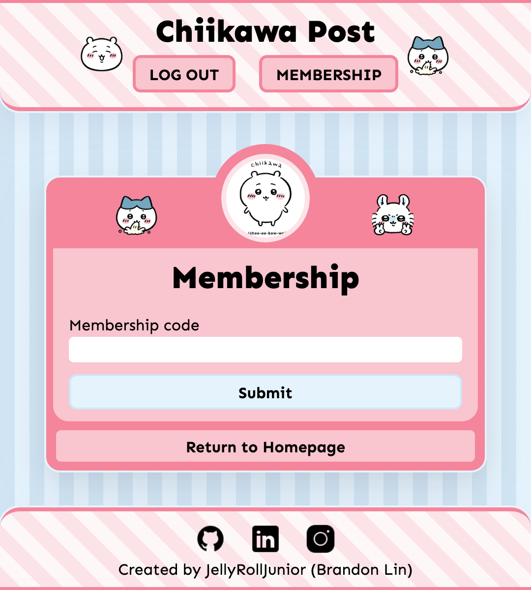
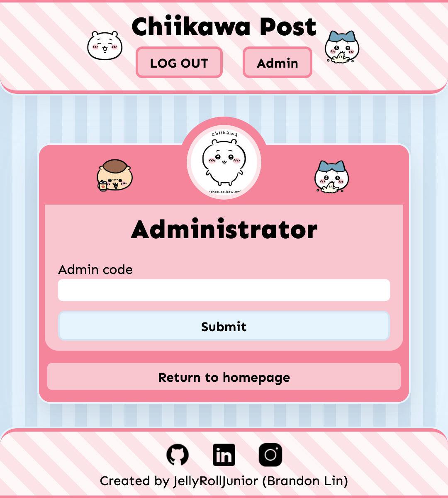
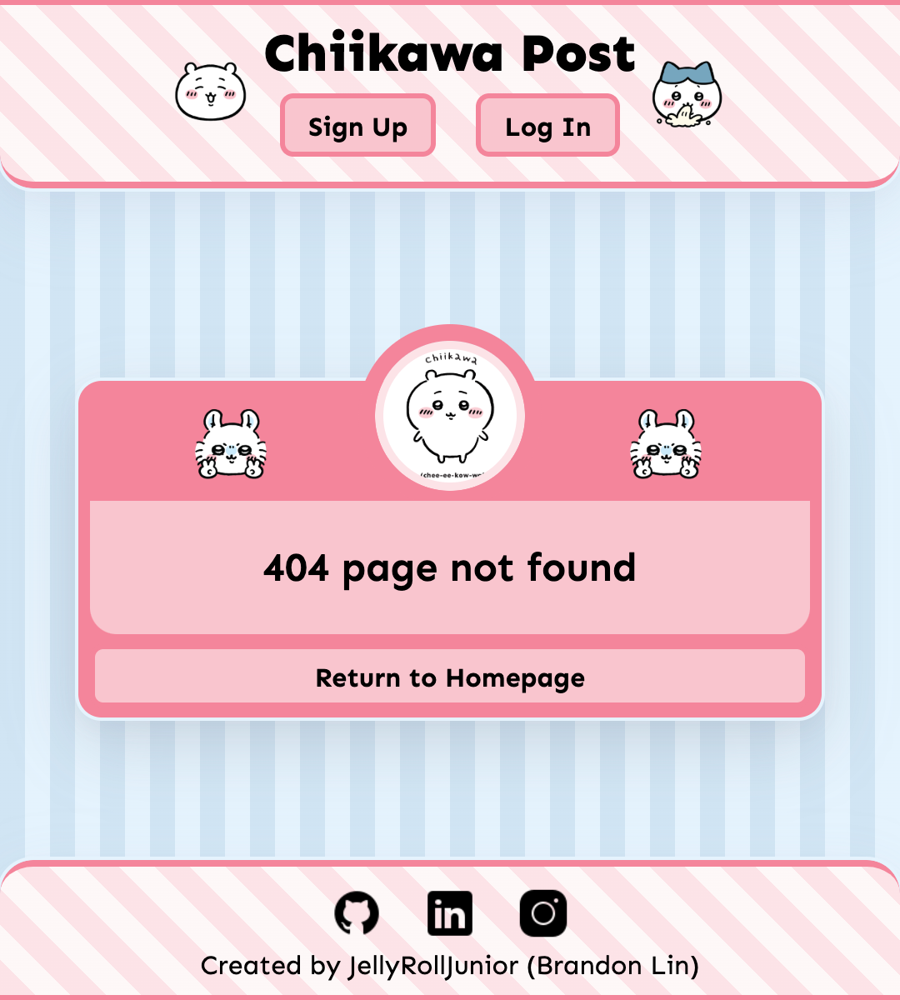

<h1 align="center">Chiikawa Post</h1>
<h3 align="center">Share your world with Chiikawa by your side <a href='' target="_blank">here</a>!</h3>

    

### Description

- Post your thoughts on a cute Chiikawa themed message board!

### Features

- Post your message with an adorable chiikawa image companion
    - Messages have title, message, image selected, time sent, author
- Create an account to post messages
    - upgrade your account to member then admin using secret codes
- Four types of users: no account, Account, Member, Admin
- A custom image selector when making post (took me a long time!)
- Mega cute layout designed by ME. AND my love and effort!

### Account Permissions

|              |  View Posts  |  Create Posts  |  View Post Sender & Send Time  |  Delete Posts  |
|  ----------  |  :--------:  |  :----------:  |  :--------------------------:  |  :----------:  |
|  No account  |      ✅      |       ❌       |               ❌               |       ❌       |
|  Account     |      ✅      |       ✅       |               ❌               |       ❌       |
|  Member      |      ✅      |       ✅       |               ✅               |       ❌       |
|  Admin       |      ✅      |       ✅       |               ✅               |       ✅       |

### Stack

-   PostgreSQL
-   NodeJS, Express
-   HTML, EJS, CSS
-   DB Hosting: neon.tech
-   Server Hosting: Render.com
-   Notable libraries: 
    - Passport (auth)
    - Obscenity (text censoring)
    - date-fns (date formatting)
    - bcryptjs (hashing passwords)

## App Showcase

|  Deleting post   | 
|  --------------  | 
|  | 

|  Signing up  |  Login  |
|  ----------  |  -----  | 
|  |  |

|  Member access  |  Admin access  | 
|  -------------  |  ------------  | 
|  |  |

|  Error page  | 
|  ------------  | 
|  |

## Learning Outcomes

### Retrospective (aka yapping)

## Acknowledgements

| Usage   |     Source     |
| ------- | -------------- |
| Icons   | icons8.com     |
| Specs   | [The Odin Project](https://www.theodinproject.com/lessons/node-path-nodejs-members-only) |
